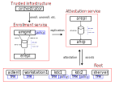

# NewHCP

The structure of this README is as follows;

* **[Quick reference](#quick-reference)** for building and running
* **[What](#what-it-is-and-what-it-does)** it is and what it does

---

## Quick reference

### Host system dependencies

```
sudo apt-get install -y docker-compose openssl heimdal-clients
```

### Clone and build

```
git clone https://github.com/geoffthorpe/newhcp
git submodule update --init
make
```

### Run the example workflow (test)

```
# The docker-compose stuff depends on TOP being set
export TOP=$(pwd)

# Run the test, which will clean up after itself, with quiet output
Q=1 ./test.sh

# Run the test, with verbose output, and leave all the containers
# running, in order to allow manual interaction.
V=1 NOTRAP=1 ./test.sh
```

### Examining host container state

```
# Show the health status of the containers
docker-compose ps

# Show (+follow) the enrollment and attestation service containers
docker-compose logs -f emgmt erepl arepl ahcp

# Get a root shell on the secondary KDC
docker-compose exec kdc_secondary bash
```

### Step 1 of 2: get a Kerberos-authenticated shell

```
docker-compose exec workstation1 bash
root@workstation1:/# su - luser
luser@workstation1:~$ kinit \
    -C FILE:/home/luser/.hcp/pkinit/user-luser-key.pem luser bash
luser@workstation1:~$ echo $KRB5CCNAME 
FILE:/tmp/krb5cc_zJ0xtC
```

### Step 2 of 2: ssh

```
luser@workstation1:~$ ssh -p 2222 sherver.hcphacking.xyz
luser@sherver:~$
```

### Teardown all running containers

```
docker-compose down -v
```

---

## What it is and what it does

### **[HCP (Host Cryptographic Provisioning)](doc/hcp.md)**

Reference implementation of a TPM-enrollment-based attestation framework for provisioning hosts with secret and non-secret assets. [Click here for more detail.](doc/hcp.md) Here is a diagram overview of HCP's reference usecase;



### Software TPM service

Consumes TPM state created by the `orchestrator` tool. Can be instantiated as a side-car container (using a shared-mount for host communication - no networking) or as a cotenant service within the host container.

### **[Stateless KDC (Kerberos Domain Controller) service](doc/stateless-kdc.md)**

Demonstrates how PKI-based identity can underpin a Kerberos network, because none of the service or client (role/user) identities in the reference usecase are registered with the KDC, instead their Kerberos credentials are obtained from X509v3 certificates containing their authorized identity. Think of it as "stateless, certificate-based Kerberos".

* namespace principals (service credentials)
* synthetic principals (client credentials)
* `kdcsvc` (kadmin API, replication, ...)

### Stateless SSH (sshd) service

A cotenant service that allows a host's user accounts to become ssh-accessible using Kerberos (GSS-API) authentication. Together with the Stateless KDC service, this shows an end-to-end SSO solution running on top of an HCP-bootstrapped network.

### Policy service

A policy-enforcement service in which a JSON configuration document defines all the policy rules (iptables-like) for examining input payloads (which are also JSON) and then returns success or failure. The https-based APIs for the TPM enrollment service and the KDC both implement hooks on the back-end to support using the policy service, and the example workflow shows them in use. Ie. the service represents its client's request as a JSON document and submits that to its associated policy service for approval/rejection. This allows for an architecture to have some separation between what it enables (the application service) and what constraints it imposes (codified in the policy service).

### WebAPI service

A web-API-hosting service (based on uwsgi) for representing Flask applications and, if enabled, providing a HTTPS reverse-proxy (based on nginx) using TLS certificates obtained from TPM enrollment. This service runs co-tenant inside all the other serviecs that provide web APIs (dog-food).

### **[Tooling](doc/tooling.md)**

* Workload launcher, for defining and running workloads, consisting of services and dependencies. This consumes a basic JSON description of what has to be setup and started and runs like a container init daemon.
* JSON manipulations, for parameter expansion (HcpJsonExpander), policy evaluation (HcpJsonPolicy), programmatic manipulation (HcpJsonScope), etc.
* Extensible workflow, for building and running.
